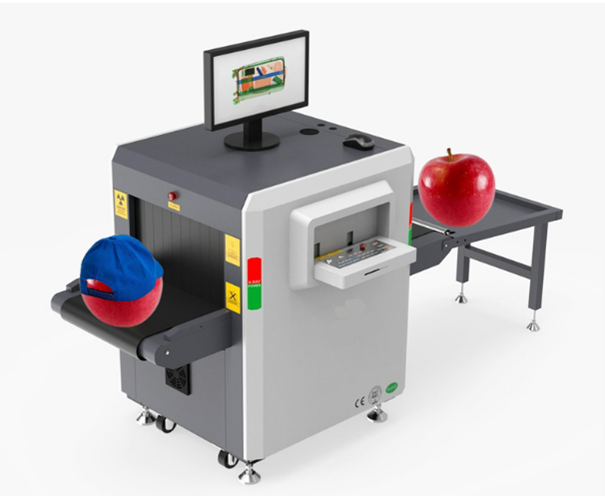
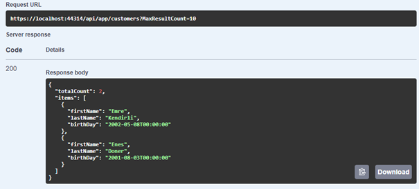
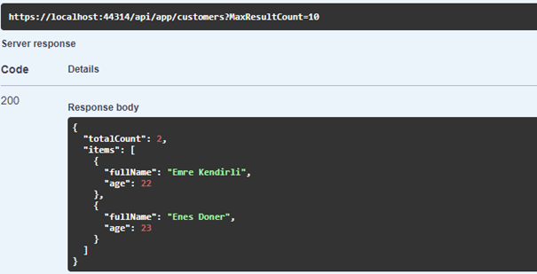

# What is Object to Object Mapping

Mapping the properties of one object to the properties of another object is called Object to object mapping. Most of the time we don't want to show the data we store to end users as it is. We only give users the information they will use for that operation. In tables that contain relationships, we analyze the relationships and present meaningful data to users. For example, suppose we have a product and a category object, we keep an attribute called categoryId in the product object. However, it would be illogical to show the categoryId attribute to users. Therefore, we create dto's (data transfer objects) and show the category name attribute to users instead of the category Id attribute. 

DTOs are used to transfer data of objects from one place to another. We often need to convert our Domain objects to DTOs and DTOs to Domain objects, for this you can use a code like this. 

````csharp
    public virtual async Task<CustomerDto> CreateAsync(CustomerCreateDto input)
    {

        var customer = await _customerManager.CreateAsync(
        input.BirthDay, input.MembershipDate, input.FirstName, input.LastName
        );
        CustomerDto customerDto = new CustomerDto
        {
            Id = customer.Id,
            FirstName = input.FirstName,
            LastName = input.LastName,
            // ...other
        };
        
        return customerDto;
    }

````
This code is repetitive, tedious to write. It violates DRY principles, makes your code very complex and reduces readability.  Instead of using this approach, you can use the automapper which does the matching automatically. Here is a better code:


````csharp
        public virtual async Task<CustomerDto> CreateAsync(CustomerCreateDto input)
        {

            var customer = await _customerManager.CreateAsync(
            input.BirthDay, input.MembershipDate, input.FirstName, input.LastName
            );

            return ObjectMapper.Map<Customer, CustomerDto>(customer);
        }
````

# What is AutoMapper?



Automapper is a .net library that automates object to object mapping. The implementation of Automapper is quite simple. In this chapter I will show you how to use the Automapper library in an ABP-based application. For this reason, I assume that you already have an ABP-based application created. If you have not yet created an ABP-based application, please follow the [Getting Started documentation](https://docs.abp.io/en/abp/latest/Getting-Started-Create-Solution?UI=MVC&DB=EF&Tiered=No).

Create a domain entity similar to this one: 

````csharp
    public class Customer : FullAuditedAggregateRoot<Guid>
    {
        public string? FirstName { get; set; }
        public string? LastName { get; set; }
        public DateTime BirthDay { get; set; }
        public DateTime MembershipDate { get; set; }
    }
````
`Custumer` contains a lot of attributes. we don't want to give all of these attributes to users, so create dto with only the necessary attributes: 

````csharp
    public class CustomerGetDto
    {
        public string? FirstName { get; set; }
        public string? LastName { get; set; }
        public DateTime BirthDay { get; set; }
    }
````

You can use this code to list customers:

````csharp
public virtual async Task<PagedResultDto<CustomerGetDto>> GetListAsync(GetCustomersInput input)
 {
     var totalCount = await _customerRepository.GetCountAsync(input.FilterText, input.FirstName, input.LastName, input.BirthDayMin, input.BirthDayMax, input.MembershipDateMin, input.MembershipDateMax);
     var items = await _customerRepository.GetListAsync(input.FilterText, input.FirstName, input.LastName, input.BirthDayMin, input.BirthDayMax, input.MembershipDateMin, input.MembershipDateMax, input.Sorting, input.MaxResultCount, input.SkipCount);

     return new PagedResultDto<CustomerGetDto>
     {
         TotalCount = totalCount,
         Items = ObjectMapper.Map<List<Customer>, List<CustomerGetDto>>(items)
     };
 }
````

Update your `YourApplicationAutoMapperProfile` class so that `Customer` and `CustomerGetDto` entities can convert to each other.

````csharp
public class YourApplicationAutoMapperProfile : Profile
{
    public YourApplicationAutoMapperProfile()
    {
        CreateMap<Customer, CustomerGetDto>();
    }
}
````
The swagger image of the request will be like this. Only the fields in Dtoda will appear.



In some scenarios you may want to make some customizations when matching. If you want to use `CustomerGetDto` in this way:

````csharp
  public class CustomerGetDto
  {
      public string? FullName { get; set; }
      public int Age { get; set; }
  }
````
Autommapper cannot map this automatically, you need to specify the exception. Update your `YourApplicationAutoMapperProfile`.

````csharp

CreateMap<Customer, CustomerGetDto>().ForMember(c=>c.FullName,opt=> opt.MapFrom(src => src.FirstName + " " + src.LastName))
    .ForMember(c=>c.Age, opt=> opt.MapFrom(src=> DateTime.UtcNow.Year -src.BirthDay.Year));

````
This script concatenates and matches **FirstName** and **LastName** in the **FullName** field and subtracts **BirthDate** from today's year and assigns it to the customer's **Age**
When you make a request, your output will look like the one below.



For more information on object to object mapping with abp framework, see the [documentation](https://docs.abp.io/en/abp/latest/Object-To-Object-Mapping)